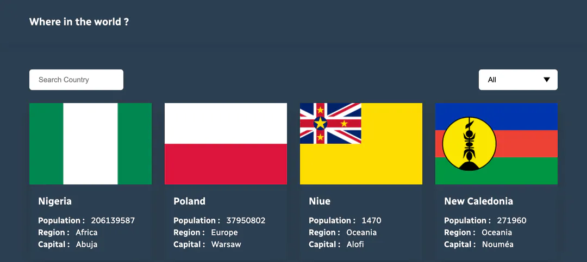

# Countries Data Lookup

Country data lookup application built with React and based on the REST Countries API

#### Packages I use.
- react-router-dom
- sass

`git clone https://github.com/ibrahimgediktr/rest-countries-api.git`

#### `yarn install`

#### `yarn start`

Runs the app in the development mode.\
Open [http://localhost:3000](http://localhost:3000) to view it in the browser.

